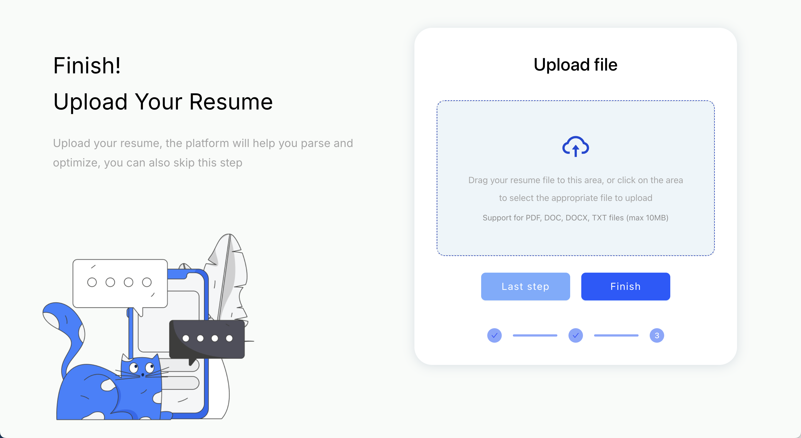

# Resume Upload App

基于 React + Ant Design 的简历上传页面。



## 功能特点

- 拖拽上传文件
- 支持PDF、DOC、DOCX、TXT格式，最大10MB
- 响应式布局，适配桌面和移动端
- 文件预览和删除功能

## 技术栈

- React 18
- Vite
- Ant Design
- CSS3

## 快速开始

```bash
# 安装依赖
npm install

# 开发环境运行
npm run dev

# 构建
npm run build
```

访问 `http://localhost:5173` 查看效果。

## 项目结构

```
src/
├── App.jsx          # 主组件
├── App.css          # 样式文件
├── main.jsx         # 入口文件
├── index.css        # 全局样式
└── assets/
    └── picture.png  # 背景图片
```